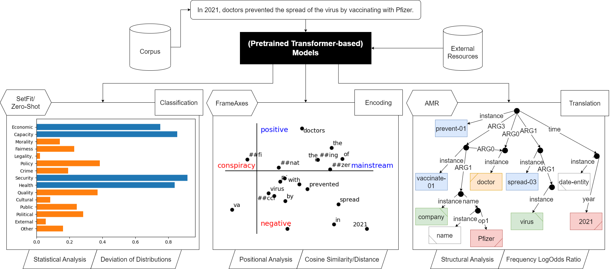

# Web23 PhD Symposium

This is the companion repository for the paper in the [PhD Symposium track at The Web Conference 2023](https://www2023.thewebconf.org/calls/phd-symposium/). Link to the paper: [10.1145/3543873.3587534](https://dl.acm.org/doi/10.1145/3543873.3587534).

It contains the code to reproduce the example given in Figure 1:

Overview of the three complementary approaches. Subfigures show the result of a transformation with each approach. In (a), a predefined set of labels is predicted, here in a zero-shot setting, and the label probabilities are plotted (blue for predicted labels with high probability). In (b), the tokens of the sentence are projected onto framing axes in 2-dimensional embedding space, where the axis poles are opposing each other (e.g., positive vs negative). In (c), the text is transformed into a semantic (rooted, directed, and acyclic) graph.

---

The result for each sub-plot is calculated in their respective notebook:
- [a_statistical.ipynb](a_statistical.ipynb)
- [b_positional.ipynb](b_positional.ipynb)
- [c_structural.ipynb](c_structural.ipynb)

These results are then included in the overall Figure (with the graph also being recreated for visual purposes).
